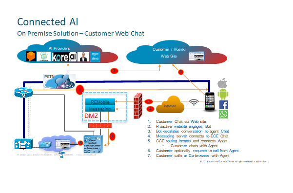
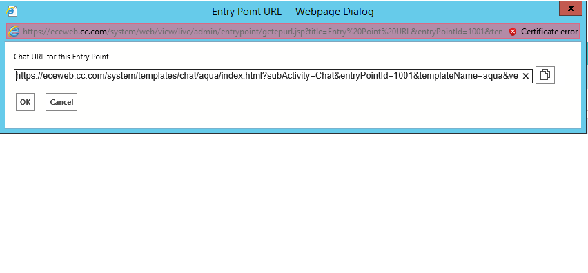
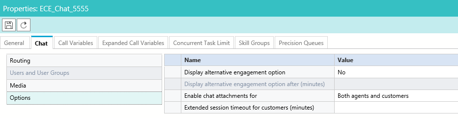

# CumulusFinance
Cumulus Finance is a ficticous Financing company that offers many of their services via traditional methods and social media. The example code
within this project illustrates the interactions of their customers through Web Chat. This sample uses a Bot (DialogFlow)
which facilitates the customer dialog and then transfers the chat to a contact center agent if needed.

>  Prerequisites
- >  DialogFlow 
- >  Cisco Contact Center (UCCE / PCCE) version 11.6
- >  Cisco Enterprise Chat and Email Version 11.6
  
>  Optional 
- > Remote Expert Mobile version 11.6

This project includes a sample website and all of the javascript that is needed. This sample should run on any webserver.

>  Configuration Required

Within the core Bot which is primarily written in the 'floatbot.html' file, you will need to configure the DialogFlow
access Token: 
- [ ] var accessToken = "YOUR ACCESS TOKEN";

> Note: The configuration hard codes the customers information. In a production system you would include a mechanism
> to authenticate the customer, retrieve account information and then use this information within the interaction.

The next configuration task within this file is for the ECE integration. Here will will set the Chat Entry Point to what
your ECE system is configured for.

- [ ] var ChatEntryPointId = "1001";

If you don't know your configured Chat Entry point within ECE, you can log into the ECE system as an Administrator
and navigate to the Department->Service->Chat-Entry Point configuration as shown below to locate the Entry Point.

Next configuration task will be the customers info gatered from your authentication mechanism;

- [ ] var PhoneNumber = "";
- [ ] var EmailAddress = "michael.littlefoot@cc.com";
- [ ] var FirstName = "Michael";
- [ ] var LastName = "Littlefoot";

You are now done configuring this file. The next configuration is done within the 'js/with-input-parameters.js' file.
Within this javascript file there are configurations settings for ECE and functions for Remote Expert Mobile. If you
are not using REM, you can ignore these.

At the top of the file you will need to configure the base URL for your ECE Web server.

- [ ] myLibrarySettings.CORSHost = "https://yourecewebserver/system";
- [ ] myLibrary.CORSHost = "https://yourecewebserver/system";

If you will be allowing the sending of attachments to the agent, you will need to configure ECE to allow attachments.
Again, within the ECE Administration, you will need to navigate to the Workflow->Queues and select the Chat Queue you
will be using and enable the sending of attachments as shown below;

> Note: There are some configurations and functions within here for the handling of transcripts of the conversation 
> between the customer and the Bot. Within this sample, we use Cisco Context Service for storing the transcripts. If
> you are using another method or not saving the transcript, you can ignore these sections.

You should now be setup for testing. This guide assumes that you have already setup DialogFlow for this implementation. 
If you havn't, you can get started at the following URL.
https://dialogflow.com/docs/getting-started

